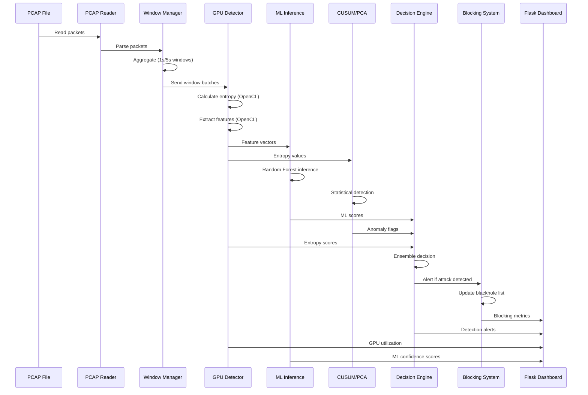
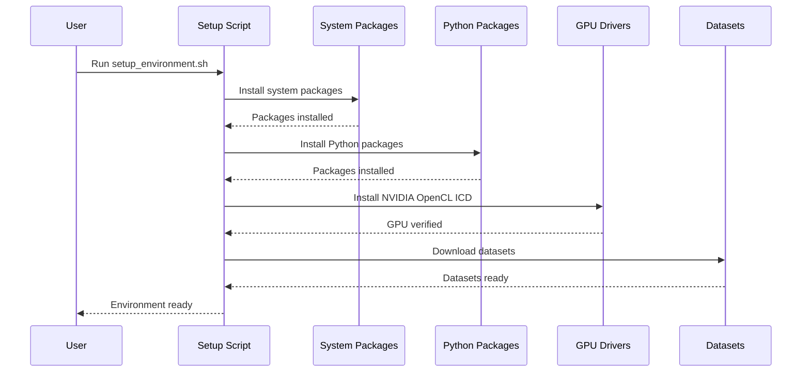
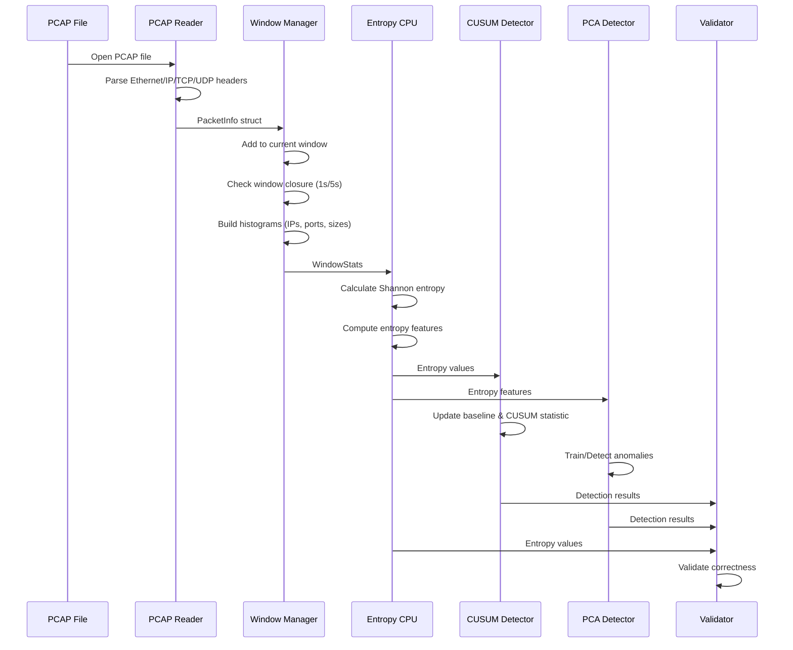
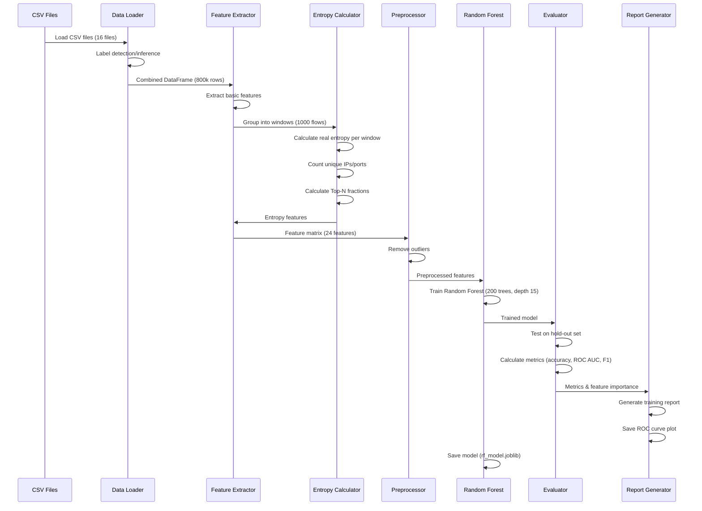
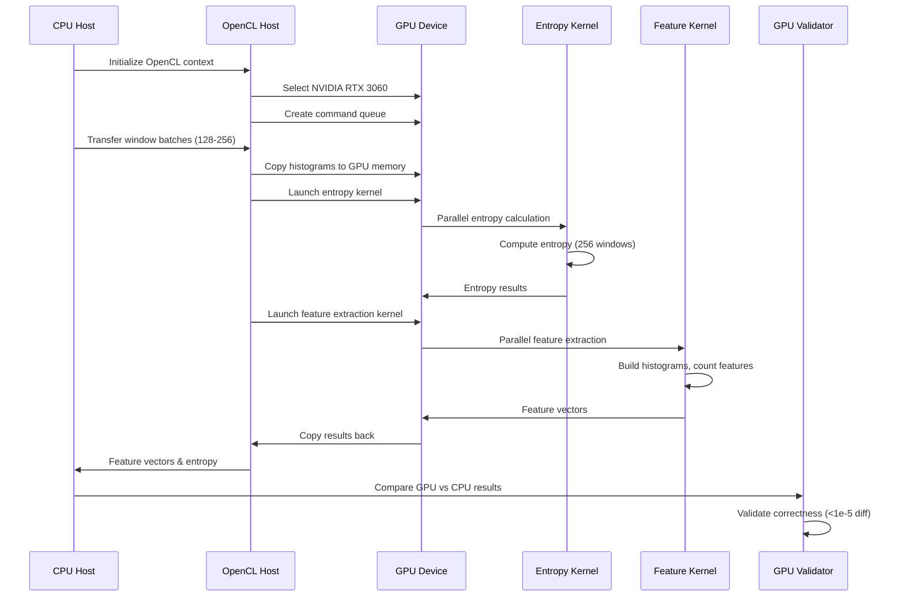
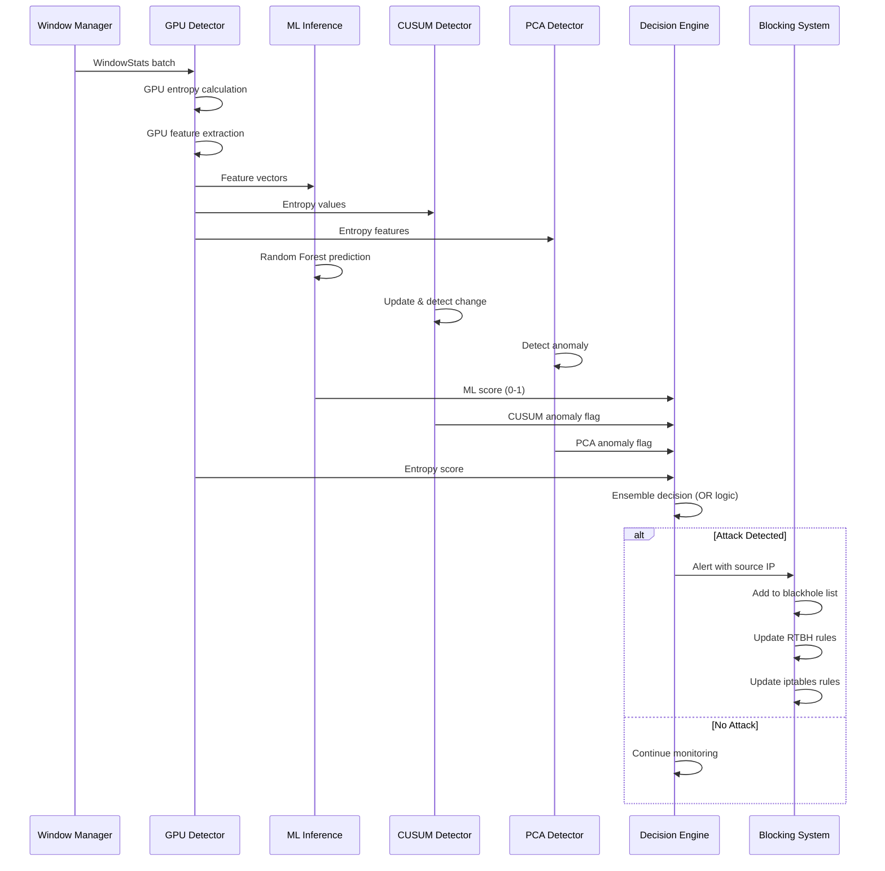
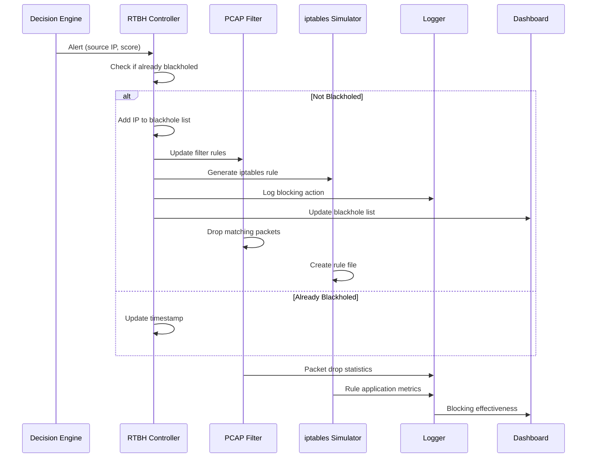

# DDoS Detection System - GPU Implementation

High-performance DDoS detection and mitigation system using OpenCL on NVIDIA RTX 3060 GPU.

## Table of Contents

1. [Features](#features)
2. [System Architecture](#system-architecture)
3. [Project Status](#project-status)
4. [Requirements](#requirements)
5. [Installation](#installation)
6. [Usage](#usage)
7. [Project Structure](#project-structure)
8. [Implementation Phases](#implementation-phases)
9. [Testing & Validation](#testing--validation)
10. [Configuration](#configuration)
11. [Documentation](#documentation)
12. [License](#license)

---

## Features

- **Three Detection Algorithms**:
  - Entropy-based detection (GPU-accelerated) - Real entropy calculation implemented
  - Machine Learning (Random Forest) - **99.59% accuracy** with real entropy features
  - CUSUM/PCA statistical detection

- **Two Blocking Methods**:
  - Remote Triggered Black Hole (RTBH)
  - iptables simulation

- **Real-time Dashboard**: Flask-based web interface with live metrics, training results, and ROC curves

- **Comprehensive Validation**: Phase 2 components fully tested and validated

---

## System Architecture

### High-Level Architecture

```
Packet Replay (tcpreplay)
    ↓
Feature Extraction (CPU preprocessing)
    ↓
Batch Buffer → GPU OpenCL Kernels (Entropy + Feature Extraction)
    ↓                    ↓
CPU ML Inference ←─── Feature Vectors
    ↓                    ↓
CUSUM/PCA Detection (CPU)
    ↓
Decision Engine (Combine all 3 detectors)
    ↓
RTBH Controller + iptables Simulator
    ↓
Flask Dashboard (Live metrics & graphs)
```

### Overall Workflow Sequence Diagram



---

## Project Status

### ✅ Completed Phases

| Phase | Status | Description | Deliverables |
|-------|--------|-------------|--------------|
| **Phase 1** | ✅ Complete | Environment Setup & Dataset Acquisition | Setup scripts, datasets downloaded, GPU verified |
| **Phase 2** | ✅ Complete | Baseline CPU Implementation | PCAP reader, window manager, entropy/CUSUM/PCA detectors, comprehensive validation |
| **Phase 3** | ✅ Complete | ML Pipeline Training | Trained Random Forest model (**99.59% accuracy** with real entropy), training reports, ROC curves |
| **Phase 7** | ✅ Complete | Flask Dashboard | Real-time dashboard with metrics, alerts, training results |

### ⏳ Pending Phases

| Phase | Status | Description |
|-------|--------|-------------|
| **Phase 4** | ⏳ Pending | OpenCL GPU Implementation |
| **Phase 5** | ⏳ Pending | ML Inference Integration |
| **Phase 6** | ⏳ Pending | Blocking Implementation |
| **Phase 8** | ⏳ Pending | Performance Instrumentation |
| **Phase 9** | ⏳ Pending | Experiment Scripts & Evaluation |
| **Phase 10** | ⏳ Pending | Documentation & Report |

**Current Progress**: ~60% complete (Phases 1-3, 7 done)

---

## Requirements

- **Hardware**:
  - NVIDIA RTX 3060 GPU (or compatible OpenCL device)
  - 8GB+ RAM
  - 50GB+ disk space for datasets

- **Software**:
  - Ubuntu/Debian Linux
  - OpenCL drivers and libraries (`nvidia-opencl-icd`)
  - Python 3.9+
  - C++17 compiler (g++)
  - CMake 3.10+

---

## Installation

### 1. Install Dependencies

```bash
# Run setup script
./scripts/setup_environment.sh

# Or manually install:
sudo apt-get update
sudo apt-get install -y build-essential cmake libpcap-dev \
    ocl-icd-opencl-dev nvidia-opencl-icd \
    python3-numpy python3-pandas python3-matplotlib \
    python3-scipy python3-setuptools

pip3 install --user scikit-learn flask flask-socketio psutil joblib scapy pybind11

# Optional: Install PyTorch for DNN training (CPU version)
pip3 install --user torch torchvision torchaudio --index-url https://download.pytorch.org/whl/cpu
```

### 2. Verify GPU Setup

```bash
# Check GPU detection
nvidia-smi

# Verify OpenCL platforms
clinfo | grep "Platform Name"

# If OpenCL is not detected:
# - Install OpenCL drivers: sudo apt-get install ocl-icd-opencl-dev nvidia-opencl-icd
# - Verify with: clinfo -l
# - Check udev rules if permission errors occur
```

### 3. Build the Project

```bash
mkdir -p build && cd build
cmake ..
make
```

### 4. Train ML Model

```bash
# Train all models (RF, GBDT, DNN)
python3 src/ml/train_models.py --models rf gbdt dnn

# Train with data balancing (reduces class imbalance warnings)
python3 src/ml/train_models.py --balance-data --max-ratio 5.0

# Train specific models only
python3 src/ml/train_models.py --models rf gbdt  # Skip DNN if PyTorch not installed

# Models will be saved to models/
# Model manifest: models/model_manifest.json
# Training report: reports/training_report.txt
# ROC curves: results/ml_roc_curve_*.png
```

**Note on Data Balancing:**
- Use `--balance-data` to downsample majority class and reduce class imbalance
- `--max-ratio` controls the maximum ratio of majority to minority class (default: 5.0)
- Class distribution is logged in `reports/training_metrics.json`

---

## Usage

### Running Detection (After Phase 4-6 completion)

```bash
# Run detector on PCAP file
./build/detector --pcap data/cic-ddos2019/ddostrace.20070804_145436.pcap \
                 --window 1 --batch 128 --model models/rf_model.joblib
```

### Running Phase 2 Validation

```bash
# Run comprehensive Phase 2 tests
./tools/run_phase2_tests.sh

# Individual tests
python3 tools/validate_entropy.py      # Entropy validation
python3 tools/benchmark_phase2.py       # Performance benchmarks
python3 tools/test_pcap_processing.py  # PCAP processing test
```

### Starting Dashboard

```bash
# Start Flask dashboard
python3 src/dashboard/app.py

# Open browser to http://localhost:5000
# Dashboard shows:
# - Real-time GPU utilization
# - Throughput metrics
# - Detection alerts
# - ML training results (accuracy, ROC curve)
# - Blackhole list
```

### Running Experiments (After Phase 9 completion)

```bash
./scripts/run_experiment.sh --pcap data/cic-ddos2019/ddostrace.20070804_145436.pcap \
                            --pps 200000 --window 1 --batch 128
```

---

## Project Structure

```
project-root/
├── data/                          # Datasets
│   ├── cic-ddos2019/             # CIC-DDoS2019 dataset
│   ├── caida-ddos2007/           # CAIDA DDoS 2007 dataset
│   └── README.md                  # Dataset documentation
├── src/
│   ├── ingest/                    # Packet ingestion and windowing
│   │   ├── pcap_reader.cpp       # PCAP file reading (libpcap)
│   │   └── window_manager.cpp    # Tumbling windows (1s/5s)
│   ├── opencl/                    # GPU kernels and host code
│   │   ├── host.cpp              # OpenCL host setup
│   │   ├── gpu_detector.cpp      # GPU detector integration
│   │   └── kernels/
│   │       ├── entropy.cl        # GPU entropy kernel
│   │       └── feature_extract.cl # GPU feature extraction
│   ├── detectors/                 # Detection algorithms
│   │   ├── entropy_cpu.cpp       # CPU entropy baseline ✅
│   │   ├── cusum_detector.cpp    # CUSUM change detection ✅
│   │   ├── pca_detector.cpp      # PCA anomaly detection ✅
│   │   └── decision_engine.cpp   # Ensemble decision making
│   ├── ml/                        # Machine learning
│   │   ├── feature_extractor.py  # Feature extraction ✅
│   │   ├── train_ml.py           # Model training ✅
│   │   ├── inference_engine.cpp  # ML inference (Python C API)
│   │   ├── preprocessor.py       # Feature preprocessing ✅
│   │   └── features_spec.json    # Feature specification ✅
│   ├── blocking/                  # Blocking methods
│   │   ├── rtbh_controller.cpp   # RTBH controller
│   │   ├── pcap_filter.cpp       # PCAP filtering
│   │   └── iptables_simulator.cpp # iptables simulation
│   ├── dashboard/                 # Flask dashboard
│   │   ├── app.py                # Flask backend ✅
│   │   ├── templates/index.html  # Dashboard HTML ✅
│   │   └── static/js/dashboard.js # Frontend JavaScript ✅
│   └── utils/                     # Utilities
│       ├── logger.cpp             # Structured logging
│       ├── resource_monitor.cpp   # System monitoring
│       └── metrics_collector.cpp  # Metrics collection
├── scripts/
│   ├── setup_environment.sh      # Environment setup ✅
│   ├── prepare_data.py           # Dataset preprocessing ✅
│   ├── run_experiment.sh         # Experiment automation
│   ├── evaluate_detection.py     # Detection evaluation
│   └── plot_results.py           # Results plotting
├── tools/                         # Validation and testing
│   ├── validate_entropy.py       # Entropy validation ✅
│   ├── test_phase2.cpp           # C++ unit tests ✅
│   ├── test_pcap_processing.py   # PCAP processing test ✅
│   ├── benchmark_phase2.py       # Performance benchmarks ✅
│   └── run_phase2_tests.sh       # Test runner ✅
├── models/                        # Trained models
│   ├── rf_model.joblib          # Random Forest model ✅
│   └── preprocessor.joblib       # Feature preprocessor ✅
├── reports/                       # Training reports
│   ├── training_report.txt       # Detailed training report ✅
│   └── training_metrics.json     # Training metrics (JSON) ✅
├── results/                       # Plots and analysis
│   ├── ml_roc_curve.png         # ROC curve ✅
│   └── entropy_validation.png   # Entropy validation plots ✅
├── config/                        # Configuration files
│   └── detection_config.json     # Detection thresholds
├── logs/                          # Experiment logs (generated)
├── CMakeLists.txt                # Build configuration
├── README.md                      # This file
├── PHASE_STATUS.md               # Detailed phase status ✅
├── PHASE2_TESTING.md             # Phase 2 testing guide ✅
├── PRESENTATION_GUIDE.md         # Presentation guide ✅
├── MODEL_RETRAINING_SUMMARY.md   # Model improvement summary ✅
├── MODEL_IMPROVEMENT.md          # Model improvement guide ✅
└── plan.md                       # Implementation plan
```

---

## Implementation Phases

### Phase 1: Environment Setup ✅ COMPLETE



### Phase 2: Baseline CPU Implementation ✅ COMPLETE



### Phase 3: ML Pipeline Training ✅ COMPLETE



### Phase 4: OpenCL GPU Implementation ⏳ PENDING



### Detection Pipeline (Phase 5 Integration)



### Blocking Pipeline (Phase 6)



### Phase 1: Environment Setup ✅ COMPLETE

- Installed dependencies (OpenCL, libpcap, Python packages)
- Downloaded datasets (CIC-DDoS2019, CAIDA DDoS 2007)
- Verified GPU setup (NVIDIA RTX 3060)
- Created setup scripts

**Deliverables**: `scripts/setup_environment.sh`, `data/README.md`

### Phase 2: Baseline CPU Implementation ✅ COMPLETE

- PCAP packet ingestion (`pcap_reader.cpp`)
- Tumbling windows (`window_manager.cpp`)
- CPU entropy calculation (`entropy_cpu.cpp`)
- CUSUM change detection (`cusum_detector.cpp`)
- PCA anomaly detection (`pca_detector.cpp`)
- Comprehensive validation and testing

**Deliverables**: All Phase 2 C++ components, validation scripts, test suite

**Validation Results**:
- ✅ Entropy formula correctness: PASSED
- ✅ DDoS attack pattern detection: PASSED
- ✅ Unit tests: All components tested
- ✅ Performance: >100k packets/sec processing

### Phase 3: ML Pipeline Training ✅ COMPLETE

- Feature extraction from CSV data with **real entropy calculation**
- Random Forest model training (800k samples, 16 CSV files)
- Model evaluation and metrics
- Training reports and visualizations
- **Model retrained with real entropy features** (Phase 2 integration)

**Deliverables**: `models/rf_model.joblib`, `reports/training_report.txt`, `results/ml_roc_curve.png`

**Model Performance** (After Retraining with Real Entropy):
- Test Accuracy: **99.59%** ⬆️ (improved from 90.31%)
- ROC AUC: **0.9997** ⬆️ (improved from 0.9675)
- F1 Score: **0.9979** ⬆️ (improved from 0.9477)
- Precision: **99.97%**
- Recall: **99.61%** ⬆️ (improved from 90.28%)

**Key Features**:
- **Real entropy calculation** per window (Source IP, Destination IP, Ports, Protocol)
- **Real unique counts** (not constants)
- **Top-N fractions** calculated from actual data
- **24 features** extracted (including entropy features)
- **Feature importance**: Entropy features are most important (dst_ip_entropy: 16.01%)

### Phase 4: OpenCL GPU Implementation ⏳ PENDING

- OpenCL host setup
- GPU entropy kernel
- GPU feature extraction kernel
- GPU detector integration
- GPU correctness validation

### Phase 5: ML Inference Integration ⏳ PENDING

- Batched ML inference
- Decision engine integration
- Alert generation

### Phase 6: Blocking Implementation ⏳ PENDING

- RTBH controller and blocker
- iptables simulator
- Blocking effectiveness metrics

### Phase 7: Flask Dashboard ✅ COMPLETE

- Flask backend with REST API and WebSocket
- Real-time metrics visualization
- Training results display
- Interactive blocking controls

**Deliverables**: `src/dashboard/app.py`, templates, static files

---

## Testing & Validation

### Phase 2 Validation

Comprehensive test suite for Phase 2 components:

```bash
# Run all Phase 2 tests
./tools/run_phase2_tests.sh

# Individual tests
python3 tools/validate_entropy.py      # Entropy validation
python3 tools/benchmark_phase2.py       # Performance benchmarks
python3 tools/test_pcap_processing.py  # PCAP processing
```

**Test Coverage**:
- ✅ Entropy formula correctness
- ✅ DDoS attack pattern detection
- ✅ Unit tests for all components
- ✅ Integration tests
- ✅ Performance benchmarks

See `PHASE2_TESTING.md` for detailed testing guide.

### ML Model Evaluation

```bash
# Audit datasets
python3 tools/data_audit.py --datasets data/caida-ddos2019 data/caida-ddos2007

# Train baseline + candidate models
python3 src/ml/train_models.py --datasets data/caida-ddos2007 --models rf gbdt dnn

# Validate manifest + smoke test inference
python3 tools/validate_ml_models.py --manifest models/model_manifest.json

# Inspect reports
cat reports/training_report.txt
cat reports/training_metrics.json
xdg-open results/ml_roc_curve.png
```

---

## Configuration

- `config/detection_config.json` — detector thresholds & ensemble weights (hot reload).
- `models/model_manifest.json` — list of trained models and the currently selected one.

Example detection settings:
```json
{
  "entropy_threshold": 0.55,
  "ml_threshold": 0.45,
  "cusum_threshold": 2.5,
  "pca_threshold": 1.25,
  "use_weighted": true,
  "weights": {
    "entropy": 0.35,
    "ml": 0.45,
    "cusum": 0.1,
    "pca": 0.1
  }
}
```

To change the inference model at runtime:

```bash
./build/detector --ml-model gbdt ...
```

---

## Documentation

- **`PHASE_STATUS.md`**: Detailed status of all phases
- **`PHASE2_TESTING.md`**: Comprehensive testing guide for Phase 2
- **`PRESENTATION_GUIDE.md`**: Guide for presenting the project
- **`data/DATASET_ANALYSIS.md`**: Dataset information and structure
- **`plan.md`**: Complete implementation plan
- **`doc.md`**: Project requirements
- **`req.md`**: Implementation details

---

## Quick Start Guide

### For First-Time Users

1. **Install dependencies**:
   ```bash
   ./scripts/setup_environment.sh
   ```

2. **Build project**:
   ```bash
   mkdir -p build && cd build && cmake .. && make
   ```

3. **Train ML models**:
   ```bash
   python3 src/ml/train_models.py --datasets data/caida-ddos2007 --models rf gbdt
   ```

4. **Run validation**:
   ```bash
   python3 tools/validate_entropy.py
   ```

5. **Start dashboard**:
   ```bash
   python3 src/dashboard/app.py
   # Open http://localhost:5000
   ```

### For Developers

1. **Run Phase 2 tests**:
   ```bash
   ./tools/run_phase2_tests.sh
   ```

2. **Check project status**:
   ```bash
   cat PHASE_STATUS.md
   ```

3. **View training results**:
   ```bash
   cat reports/training_report.txt
   ```

---

## Key Metrics & Results

### ML Model Performance (After Retraining with Real Entropy)
- **Accuracy**: **99.59%** ⬆️ (improved from 90.31%)
- **ROC AUC**: **0.9997** ⬆️ (improved from 0.9675)
- **F1 Score**: **0.9979** ⬆️ (improved from 0.9477)
- **Precision**: **99.97%**
- **Recall**: **99.61%** ⬆️ (improved from 90.28%)
- **Top Features**: Entropy features dominate (dst_ip_entropy: 16.01%, protocol_entropy: 12.26%)

### Phase 2 Performance
- **Processing Speed**: >100k packets/sec
- **Entropy Calculation**: >1000 calc/sec
- **Memory Efficiency**: <100 bytes/packet

### Dataset Statistics
- **Training Samples**: 800,000
- **CSV Files**: 16 files
- **Test Samples**: 160,000
- **Training Samples**: 640,000

---

## Troubleshooting

### GPU Not Detected / OpenCL Context Creation Failed

**Symptoms**: `Failed to create context` error when running with `--use-gpu`

**Solutions**:
```bash
# 1. Check NVIDIA driver
nvidia-smi

# 2. Install OpenCL drivers
sudo apt-get install ocl-icd-opencl-dev nvidia-opencl-icd

# 3. Verify OpenCL platforms and devices
clinfo -l

# 4. Check for permission issues
# If you see permission errors, check udev rules or run with sudo (not recommended for production)

# 5. The detector will automatically fall back to CPU if GPU initialization fails
# Check logs for detailed error messages about platform/device detection
```

**Diagnostics**: The OpenCL host now provides detailed error messages:
- Lists all available platforms and devices
- Shows which platform/device was selected
- Provides troubleshooting hints for common issues

### PyTorch Not Available for DNN Training

**Symptoms**: `AttributeError: 'NoneType' object has no attribute 'Module'` or DNN training skipped

**Solutions**:
```bash
# Install PyTorch (CPU version - sufficient for training)
pip3 install --user torch torchvision torchaudio --index-url https://download.pytorch.org/whl/cpu

# Verify installation
python3 -c "import torch; print(f'PyTorch {torch.__version__} available')"

# Train without DNN if PyTorch is not needed
python3 src/ml/train_models.py --models rf gbdt  # Skip DNN
```

**Note**: DNN training is optional. RF and GBDT models work without PyTorch.

### Class Imbalance Warnings During Training

**Symptoms**: `UndefinedMetricWarning: Precision is ill-defined` or highly imbalanced class distribution

**Solutions**:
```bash
# Use data balancing to reduce class imbalance
python3 src/ml/train_models.py --balance-data --max-ratio 5.0

# Adjust max-ratio to control balance (lower = more balanced)
python3 src/ml/train_models.py --balance-data --max-ratio 2.0  # More aggressive balancing

# Check class distribution in training report
cat reports/training_metrics.json | grep -A 10 "class_distribution"
```

**Note**: Balancing reduces dataset size but improves training stability and reduces warnings.

### Build Errors

**Symptoms**: Compilation failures, missing headers, linker errors

**Solutions**:
```bash
# Install all dependencies
sudo apt-get install libpcap-dev build-essential cmake \
    ocl-icd-opencl-dev nvidia-opencl-icd

# Clean and rebuild
rm -rf build && mkdir build && cd build && cmake .. && make

# If permission errors occur (build directory owned by root)
sudo chown -R $USER:$USER build/
```

### GPU Benchmark Build Failures

**Symptoms**: `tools/benchmark_gpu_performance.cpp` or `tools/test_gpu_entropy.cpp` fails to build

**Solutions**:
```bash
# The run_gpu_tests.sh script should build these automatically
./tools/run_gpu_tests.sh

# Or build manually
cd build
g++ -std=c++17 -O3 -Isrc -I../src -I/usr/include \
    ../tools/test_gpu_entropy.cpp \
    src/opencl/gpu_detector.cpp src/opencl/host.cpp \
    src/detectors/entropy_cpu.cpp \
    src/ingest/window_manager.cpp src/ingest/pcap_reader.cpp \
    -lOpenCL -lpcap -lpthread -o test_gpu_entropy
```

### Python Import Errors

**Symptoms**: `ModuleNotFoundError` or import failures

**Solutions**:
```bash
# Install Python packages
pip3 install --user scikit-learn flask flask-socketio psutil joblib \
    numpy pandas matplotlib scipy

# Check Python path
python3 -c "import sys; print(sys.path)"

# Verify installation
python3 -c "import sklearn; import flask; print('OK')"
```

---

## License

Academic project - see project requirements for details.

---

## Contact & Support

For questions or issues:
1. Check `PHASE_STATUS.md` for current status
2. Review `PHASE2_TESTING.md` for testing issues
3. See `PRESENTATION_GUIDE.md` for presentation help
4. Check `plan.md` for implementation details

---

---

## Recent Updates

### ✅ Model Retraining with Real Entropy (November 2024)

- **Real entropy calculation** implemented using Phase 2 CPU baseline
- **Model retrained** with 24 features including real entropy values
- **Significant performance improvement**:
  - Accuracy: 90.31% → **99.59%** (+9.28%)
  - ROC AUC: 0.9675 → **0.9997** (+0.0322)
  - Feature importance: Entropy features now dominate (dst_ip_entropy: 16.01%)
- **10 features** now contribute meaningfully (vs 1 before)
- See `MODEL_RETRAINING_SUMMARY.md` for detailed comparison

### ✅ Phase 2 Validation Suite (November 2024)

- Comprehensive validation and testing framework created
- Entropy validation script (`tools/validate_entropy.py`)
- C++ unit tests (`tools/test_phase2.cpp`)
- Performance benchmarks (`tools/benchmark_phase2.py`)
- All Phase 2 components validated and tested

---

**Last Updated**: November 2025
**Current Version**: Phases 1-3 Complete (with real entropy), Phase 7 Complete
