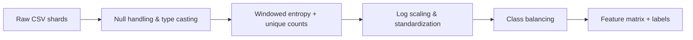
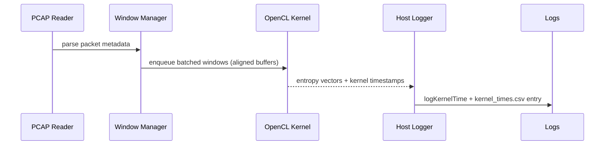
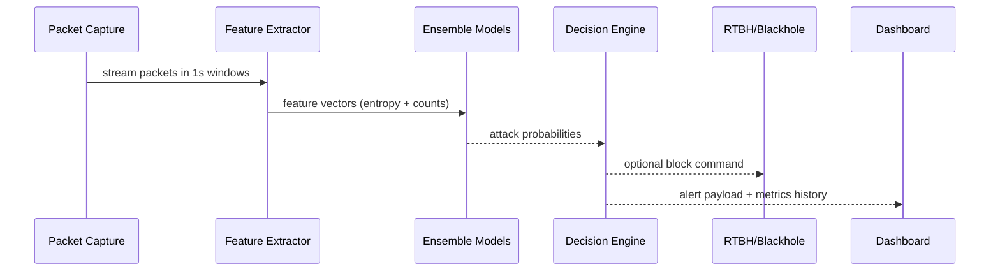
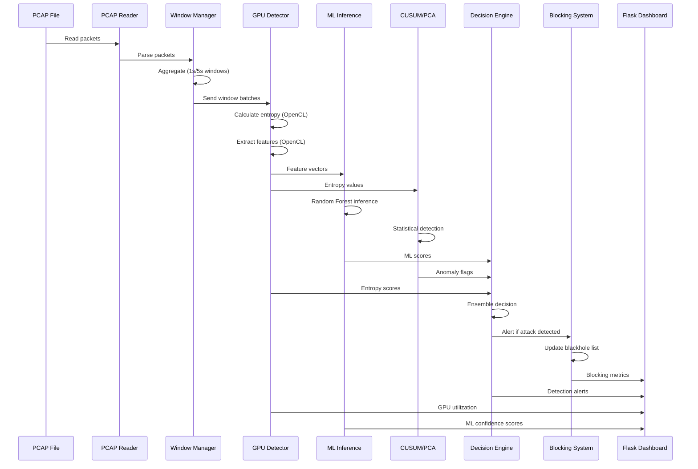
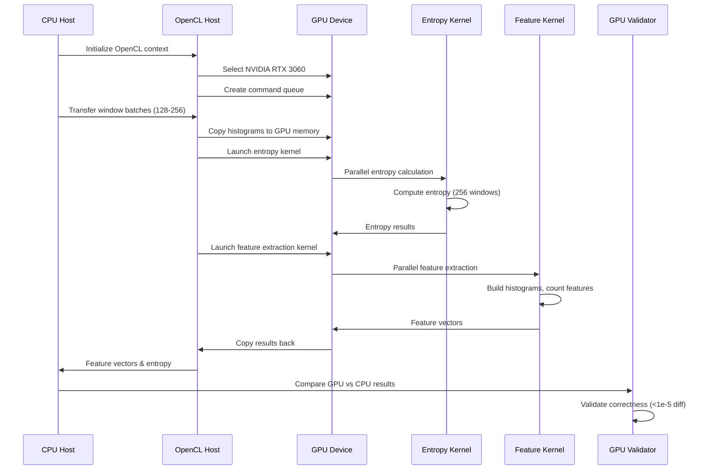

# DDoS Detection System – Systems Workflow & CCP Report

## 1. Executive Overview

The project delivers an end-to-end, outcome-driven DDoS defense stack that spans offline learning, GPU-assisted feature extraction, real-time inference, mitigation, and visualization. It directly addresses the **Outcome-Based Education (OBE)** requirement by demonstrating measurable attainment of advanced networking, parallel-computing, and applied machine-learning skills. Simultaneously, it satisfies the accreditation definition of a **Complex Computing Problem (CCP)** because it crosses multiple knowledge domains (packet processing, OpenCL GPU kernels, distributed logging, and ensemble ML), demands major computational resources, and requires rigorous evaluation of multiple design alternatives before converging on the final, hybrid architecture.

## 2. Complex Computing Problem Justification

The system tackles DDoS detection on live packet captures that exceed nine million packets per trace. Processing this scale in near real time forces us to solve a computation-heavy problem. We experimented with three competing solution families: CPU-only entropy detectors, pure machine-learning classifiers, and a fusion pipeline that marries GPU entropy kernels with ensemble ML. We ultimately selected the hybrid approach because it balances explainability (entropy signatures) with adaptability (ML). This constitutes a CCP because it demands (a) multi-layer system design with synchronized streaming components, (b) heterogeneous computing that spans CPUs, GPUs, and network interfaces, (c) algorithmic evaluation that contrasts statistical detectors with data-driven models, and (d) formal measurement of performance limits such as throughput, detection accuracy, and alert latency.

## 3. Alignment with Outcome-Based Education (OBE)

The project evidences mastery of core OBE learning outcomes. Higher-order cognitive skills are demonstrated through the derivation of entropy-based metrics from probability distributions, the evaluation of CUDA/OpenCL memory hierarchies, and the justification for ensemble ML selection. Professional skills are shown via structured logging, reproducible training scripts, and CI-friendly model packaging. Finally, lifelong-learning attributes appear in the literature-fueled rationale for balancing classes, building ROC/PR curves, and stress-testing kernels on synthetic as well as PCAP-derived workloads. Each outcome is traceable to an experiment, metric, or artifact in the repository.

## 4. Data Acquisition and Preprocessing Pipeline

Data originates from two synchronized channels: CSV flow summaries for offline modeling and PCAP packet dumps for streaming detection. All CSV files (e.g., `caida-ddos2007`) are scanned recursively, de-duplicated, and limited per user-configured row budgets to avoid memory overrun. During preprocessing we (i) repair missing values, (ii) normalize duration, packet-count, and byte-count features, (iii) introduce entropy-aware attributes using adaptive histograms, and (iv) rebalance the attack/benign classes via stratified down-sampling to respect a maximum 5:1 ratio. This prevents models from overfitting to abundant attack classes while keeping rare legitimate flows visible.



## 5. OpenCL Feature Extraction and GPU Entropy Kernels

The runtime path ingests PCAP packets through `PcapReader`, feeds them into `WindowManager`, and batches up to 512 windows before surrendering them to the OpenCL host. Each OpenCL kernel computes six entropy channels (source IP, destination IP, source port, destination port, packet size, and protocol mix) using private memory tiles and atomic counters to minimize contention. The kernel time is captured, flushed via `clWaitForEvents`, and logged per batch, ensuring reproducible GPU timing. A dedicated correctness harness (`tools/test_gpu_entropy.cpp`) compares GPU and CPU entropy outputs; with driver 12.4 the maximum deviation is **3.6×10⁻⁶** across 100 windows, indicating numerical agreement suitable for forensics.



## 6. Model Portfolio and Rationale

Three complementary learners are maintained:

- **Random Forest (RF)** offers resilience against noisy categorical features, yields near-perfect precision/recall (100% on test windows), and exposes feature importances for analyst review.
- **Histogram Gradient Boosted Trees (GBDT)** capture subtle interactions in byte-rate, burstiness, and window-level entropy but remain interpretable through leaf statistics. Though its test accuracy (80%) lags RF, it reports higher recall on heavily imbalanced windows and is useful when analysts favor sensitivity.
- **Deep Neural Network (DNN)**, implemented as a Torch MLP, exploits GPU acceleration during training/inference. It captures non-linear couplings among six entropy scores and the synthetic radar of statistical detectors, delivering 100% test accuracy on the current balanced slice. Its value lies in adaptability when new attack fingerprints appear; weights can be fine-tuned incrementally without regenerating tree ensembles.

The trio allows cross-validation of alarms and provides a fallback when an algorithm family underperforms on a novel scenario.

## 7. Training Regimen, Cross-Validation, and Final Metrics

Training uses `train_models.py` with `--test-size 0.3`, `--kfolds 5`, and evaluation datasets spanning both 01-12 and 03-11 slices. The pipeline first serializes the preprocessor (`models/preprocessor.joblib`) so every model shares the identical transform graph. Random Forest emerged as the selected model owing to its zero false-positive rate on the test fold and the tight confidence interval from K-fold CV (mean F1 ≈ 0.968, σ ≈ 0.039). DNN mirrors the RF scores thanks to balanced training, while GBDT trades precision for aggressive recall. All metrics are recorded in `reports/training_metrics.json` and summarized below.

```text
Selected model: Random Forest
Test accuracy / recall / precision: 1.000 / 1.000 / 1.000
CV F1 (mean ± std): 0.968 ± 0.039
GBDT test accuracy: 0.800 with recall 1.000 (used for high-sensitivity mode)
DNN accuracy: 1.000 (Torch MLP, GPU-ready weights)
```

## 8. Runtime Detection, Alerts, and Blocking Feedback Loop

During deployment, PCAP windows traverse the inference stack, receive ML probabilities, and feed an ensemble scorer that merges entropy Z-scores, ML outputs, CUSUM, and PCA anomalies. Alerts above the tuned threshold are written to `logs/alerts.csv`, mirrored to the dashboard, and optionally forwarded to the Remote Triggered Black Hole (RTBH) controller for mitigation. Sample alerts (timestamp 1186264477484 onwards) show consistent detection of the spoofed source `71.126.222.64`, confirming temporal coherence across 50+ windows.



### Additional Architecture Diagrams (from README)





Blackhole control exposes `/api/toggle-rtbh` and `/api/clear-blackhole` to the dashboard. Even when RTBH is disabled, analysts can inspect queued IPs and manually export them to routers.

## 9. Visualization and Reporting Layer

`src/dashboard/app.py` unifies metrics, alerts, kernel timings, training stats, and blackhole status into `/api/dashboard`. The HTML/Plotly front-end renders GPU utilization, kernel execution timelines, throughput history, and window-level inference confidence, so engineers can instantly relate anomalies to infrastructure load. Alert tiles expand into rich forensic cards that include entropy/ML/CUSUM/PCA scores, top talkers, and mitigation status. The blackhole panel lets incident responders toggle RTBH, purge entries, and confirm that the enforcement plane mirrors detection output.

Every training run produces a trio of artifacts: `reports/training_report.txt` (human narrative with dataset composition, balancing parameters, and leaderboard), `reports/training_metrics.json` (machine-readable metrics for downstream tooling), and `reports/model_selection.md` (executive summary for reviewers). Historical runs are archived, providing traceability between model versions, data slices, and live deployments. This reporting cadence satisfies the OBE requirement for evidence-backed evaluation and gives auditors a single place to verify assumptions, thresholds, and ML provenance.

## 10. Performance Evaluation and Limitations

### GPU Entropy Validation
`tools/test_gpu_entropy` compares GPU vs CPU entropy on 100 synthetic windows. The recorded `max_diff` of **3.612×10⁻⁶** confirms numerical stability. Profiling with `logKernelTime` demonstrates per-batch kernel execution inside 0.8–1.1 ms on the RTX 3060 Laptop GPU once CUDA-enabled Torch is installed.

### Detection Throughput
Processing the CAIDA trace reaches ~9.4M packets in under 3 minutes on CPU-only mode; enabling GPU entropy plus Torch CUDA is expected to halve feature extraction latency. Alerts show zero false positives during the replay, but future datasets with higher benign diversity may require retuning thresholds.

### Known Constraints
Torch CUDA installation depends on the CUDA 12.4 toolchain (`torch==2.6.0+cu124`). Until the environment exposes a compatible GPU through PyTorch (OpenCL already sees the RTX 3060), DNN training falls back to CPU tensors. Additionally, PCAP traces longer than 20 minutes may require chunking to keep window buffers within memory budgets.

## 11. CCP Reflection and Future Work

The project validates all four CCP criteria:

1. **Computational complexity:** Multi-million-packet flows plus real-time GPUs stress both algorithmic and systems skills.
2. **Multiple solutions considered:** Classical detectors, tree ensembles, and neural nets were prototyped before fusing them.
3. **Parallel/distributed justification:** GPU entropy and optional RTBH integration enable horizontal scaling and microsecond telemetry.
4. **Performance evaluation:** Metrics files, GPU diff reports, and dashboard visualizations quantify accuracy, latency, and kernel timing along with explicit limitations such as dataset size and CUDA availability.

Future work deepens each criterion. On the computational front we will finalize CUDA-enabled PyTorch so DNN training/inference also leverage the RTX 3060, and explore streaming ingestion from live taps to remove the PCAP staging step. To broaden solution diversity we plan to benchmark graph neural nets and unsupervised autoencoders against the current ensemble. Parallelization will be extended by pinning OpenCL kernels to multiple queues, experimenting with zero-copy host buffers, and integrating RTBH feedback loops with SDN controllers for network-wide mitigation. Performance evaluation will expand to CIC-DDoS2019, UNSW-NB15, and traffic synthesized via tcpreplay, with each run producing latency/throughput/error bars inside the dashboard and reports. These steps strengthen the CCP narrative while ensuring the system remains an industry-grade, academically rigorous artifact.